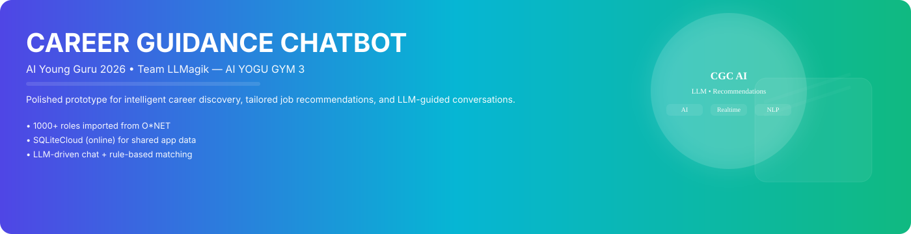
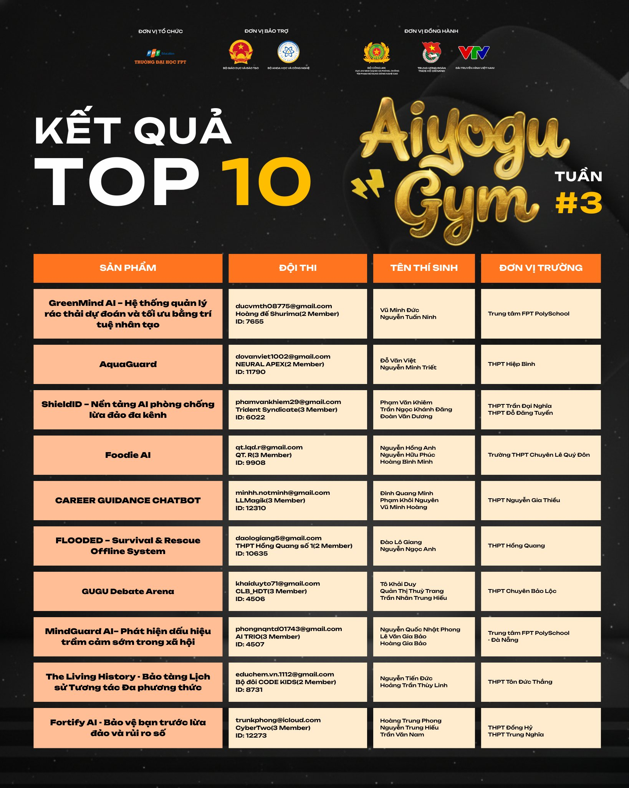

# 🚀 Career Advisor Chatbot  
### AI Young Guru 2026 – Team LLMagik - AI YOGU GYM 3

An AI-powered career advisory chatbot that helps users explore career paths, discover job information, and receive personalized recommendations using LLM technology.

<!-- Badges & visual header -->
[](https://nodejs.org/)
[](https://vitejs.dev/)
[](https://sqlite.org/)
[](https://console.groq.com/)

<p align="center">
   
</p>

<p align="center">
   <em>Polished prototype for interactive career discovery, personalized recommendations, and LLM-driven guidance.</em>
</p>

---

## 🌟 Overview

**Career Advisor Chatbot** is a prototype intelligent system designed to:

- 🔎 Support career exploration  
- 💼 Suggest relevant job roles based on user input  
- 📚 Provide a searchable job catalog (1000+ roles from O*NET)  
- 🤖 Deliver LLM-powered conversational guidance  

---

## 🧰 Tech Stack

| Layer      | Technology |
|------------|------------|
| Backend    | Node.js |
| Frontend   | Web Application |
| Database   | SQLite |
| AI Engine  | GPT-OSS 120B |
| Matching   | Rule-based Engine (Prototype) |

---

## 📁 Project Structure

Below is a complete project structure overview (expanded) to help contributors and reviewers quickly locate modules and assets.

```
myAIchatbotProject/
├── 632652149_887073670753166_3710026893000461784_n.jpg    # Hero banner
├── ai-young-guru-logo.png
├── index.html
├── 404.html
├── package.json
├── runtime-config.js
├── assets/                      # Generated frontend assets (build)
├── career-icons/                # Icon set used by the UI
├── screenshots/
├── scripts/
├── backend/
│   ├── index.js
│   ├── server.js
│   ├── config.js
   │   ├── package.json
│   ├── testLLM.js
│   ├── data/
│   │   ├── careerLibrary.js
│   │   └── generatedCareerDataset.js
│   ├── database/
│   │   ├── esco_occupations.csv
│   │   ├── schema.sql
│   │   └── seed.sql
│   ├── middleware/
│   │   └── auth.js
│   ├── routes/
│   │   ├── chat.js
│   │   ├── chatbot.js
│   │   ├── auth.js
│   │   ├── admin.js
│   │   └── analytics.js
│   └── services/
│       └── ...
├── frontend/
│   ├── index.html
│   ├── package.json
│   ├── vite.config.js
│   ├── postcss.config.cjs
│   ├── tailwind.config.cjs
│   ├── public/
│   └── src/
│       ├── main.js
│       ├── app/
│       ├── components/
│       └── styles/
└── README.MD
```

---

## 🛠 Installation & Setup

### 1️⃣ Backend Setup

```bash
cd backend
npm install
npm run setup-db
npm run dev
```

### 2️⃣ Frontend Setup

```bash
cd frontend
npm install
npm run dev
```

---

## 🌐 Production Mode (Single URL Deployment)

Serve frontend directly from backend:

```bash
cd backend
npm run build      # Run once to build frontend
npm run start
```

Or run everything with a single command from root:

```bash
npm run serve
```

Access the application at:

```
http://localhost:3001
```

---

## 🔌 API Endpoints

### Local Development

```
http://localhost:3001
```

### Deployed Backend API

```
https://api-myaichatbotproject.onrender.com
```

---

## 🗄 Database

### Main Database

- Uses **SQLiteCloud (ONLINE)**
- User/profile/chat/recommendation/job catalog data are stored online
- Backend is configured in ONLINE-only mode (no local SQLite fallback)

### ✅ Online Database Mode (Recommended for production)

Backend now uses **ONLINE database** via **SQLiteCloud**.

When configured, user/chat/profile data is stored online and shared across all backend instances.

#### Environment variables

- `DB_PROVIDER=sqlitecloud`
- `SQLITECLOUD_URL=sqlitecloud://<host>:<port>/<database>?apikey=<api-key>`

Use [`backend/.env.example`](backend/.env.example) as template for local setup.

⚠️ Security note:

- Do not commit real `.env` files.
- Put real values in GitHub **Secrets/Variables** for CI.
- This repository includes [`playwright.yml`](playwright.yml) for CI-safe env injection (no plaintext keys in git).

`SQLITECLOUD_URL` must be a real connection string, not the dashboard URL.

Optional (instead of `SQLITECLOUD_URL`):

- `SQLITECLOUD_HOST=<host>`
- `SQLITECLOUD_PORT=8860` (default)
- `SQLITECLOUD_DATABASE=<database-name>`
- One auth mode only:
  - `SQLITECLOUD_API_KEY=<api-key>` **or**
  - `SQLITECLOUD_TOKEN=<token>` **or**
  - `SQLITECLOUD_USERNAME=<username>` + `SQLITECLOUD_PASSWORD=<password>`

Optional TLS/debug option:

- `SQLITECLOUD_INSECURE=1` (only for troubleshooting; do not use in production)

#### Setup steps (SQLiteCloud)

1. Create/identify your SQLiteCloud database in dashboard.

2. Generate API key for backend access.

3. Build connection string:
   - `sqlitecloud://<host>:8860/<database>?apikey=<api-key>`

4. Set backend environment variables (local `.env` or Render env):
   - `DB_PROVIDER=sqlitecloud`
   - `SQLITECLOUD_URL=<connection-string-from-step-3>`

5. Initialize schema/migrations on online DB:
   - `npm --prefix backend run setup-db`

6. Start backend:
   - `npm --prefix backend run start`

7. Verify health:
   - `GET /health`
   - Test register/login/chat and confirm data persists after backend restart/redeploy.

#### Render deployment notes

Add these env vars in Render Service → Environment:

- `DB_PROVIDER`
- `SQLITECLOUD_URL`
- plus existing vars: `JWT_SECRET`, `ADMIN_EMAIL`, `ADMIN_PASSWORD`, `GROQ_API_KEY`, ...

After deploy, run one-time DB init command using Render Shell:

- `npm run setup-db`

Then normal runtime command remains:

- `npm run start`

### Database Commands

| Command | Description |
|---------|------------|
| `npm run setup-db` | Initialize ONLINE SQLiteCloud database (idempotent) |
| `npm run reset-db` | In ONLINE mode, warns and does not delete cloud DB |
| Auto-init | Server initializes DB automatically if empty |

---

## 📚 Career Catalog (Job Explorer)

The job catalog is also stored in SQLiteCloud (online), alongside app data.

### 📥 Import 1000+ Jobs from O*NET

```bash
npm --prefix backend run import-jobs
```

### 🔄 Reset & Re-import Jobs

```bash
npm --prefix backend run reset-jobs
```

---

## 📖 Data Source

- **O*NET Database (Text Version)**  
  https://www.onetcenter.org/dl_files/database/db_30_1_text.zip  

- **O*NET License Information**  
  https://www.onetcenter.org/license_db.html  

---

## 🤖 LLM Integration

- **Model:** GPT-OSS 120B  
- **Provider Playground:**  
  https://console.groq.com/playground?model=openai/gpt-oss-120b  

Used for conversational intelligence, contextual understanding, and personalized career guidance.

---

## ⚙️ Architecture Notes

- ☁️ SQLiteCloud for centralized ONLINE data  
- 🧠 Rule-based matching engine (optimized for rapid prototyping)  
- 🤖 LLM integration for advanced conversational support  
- 🔮 Designed for future ML-based recommendation system expansion  

---

## RESULT:

TOP 5 AI YOGU GYM 3 PROJECT

<p align="center">
   
</p>


